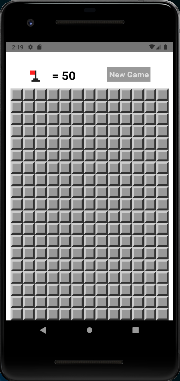
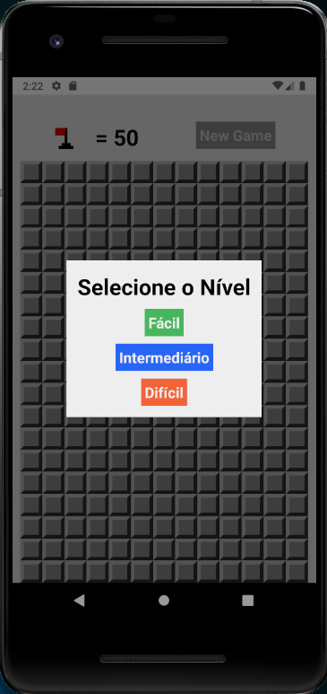
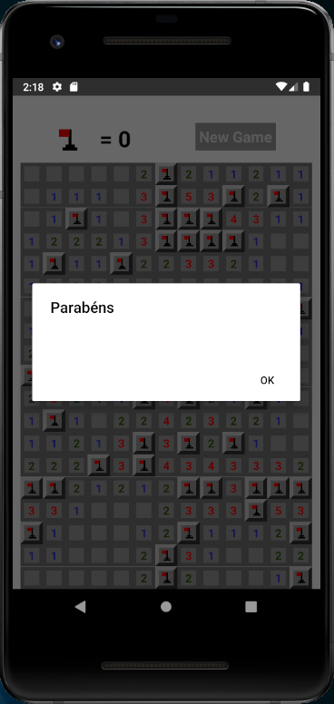
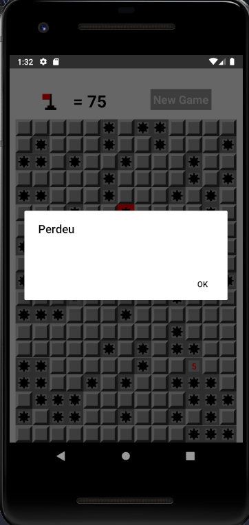

# 💣 Minesweeper 💣

Minesweeper Game <br>
Campo minado é um jogo que precisa revelar os campos sem que uma mina seja explodido. O jogo tem a opção de colocar uma bandeira nos campos que você achar que tenha minas e mostra a quantidade de minas que ainda podem existir. Além disso, também existem 3 níveis de dificuldade para jogar. <br>
Esse jogo foi criado no curso do Cod3r Cursos administrado pelo Leonardo Leitão.

## 🔖 Imagens do jogo






## 🛠 Tecnologias

As seguintes ferramentas foram usadas na construção do projeto:

- [Node.js](https://nodejs.org/en/)
- [React](https://pt-br.reactjs.org/)
- [React Native](https://reactnative.dev/)

## 🎲 Rodando o jogo

Clone o repositório
```
$ git clone https://github.com/gabynk/Minesweeper.git
```

Instale node_modules
```
$ npm install
```

Rode a aplicação no android ou ios
```
$ npx react-native run-android
$ npx react-native run-ios
```

Desenvolvido com 💜 por  **Gabriele Nakassima**